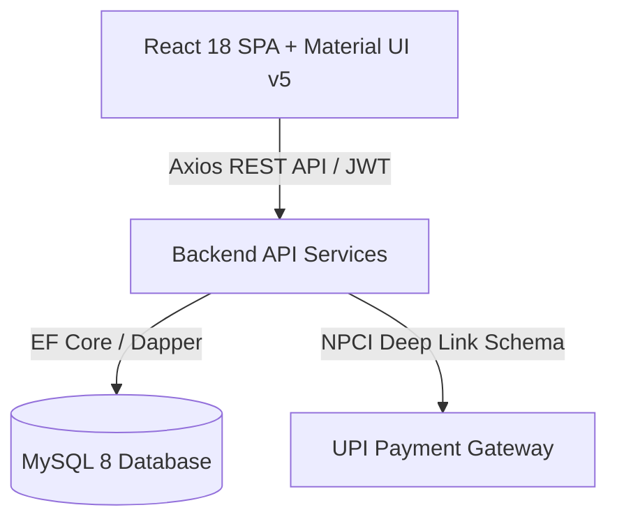

# 🚀 Growsure Project Guide & Technical Interview Preparation

---

## 📌 1. Project Overview

**Growsure** is an AI-powered, next-generation **Insurance & Wealth Management Platform**. It bridges the gap between digital risk protection (Insurance Policies across 8 sectors) and wealth creation (Mutual Fund SIPs/Lumpsum portfolios with side-by-side fund comparison and real-time calculators).

### Key Functional Modules:
1. **User Authentication & Role-Based Access Control (RBAC)**:
   - Supports 3 roles: `POLICY_HOLDER` (Customer), `INSURER` (Insurance Provider), and `ADMIN` (System Administrator).
2. **Insurance Policy Marketplace**:
   - Sector-wise insurance browsing (Health, Life, Motor, Travel, Cyber, Property, Agriculture, Business).
   - Interactive policy application, instant quotes, and payment integration.
3. **Mutual Funds Marketplace**:
   - Sourced from a real Kaggle dataset of **814 active funds**.
   - Features: Real-time Return Calculator (3Y CAGR, Lumpsum/SIP), Side-by-Side Fund Comparison, Star Ratings, Risk Scores.
4. **AI Financial Advisor & Claims Auditor**:
   - Automated insurance recommendations based on user risk profiles.
   - Automated medical claim document auditing with risk scoring and fraud detection.
5. **NPCI Standard UPI QR Payment Gateway**:
   - Real ISO/IEC 18004 scannable UPI QR code generation (`upi://pay?...`).
   - Countdown timer, compact viewport, and instant payment simulation.

---

## 🛠️ 2. Technologies Used & Architecture



### Frontend Tech Stack:
- **Framework**: React 18 with TypeScript.
- **State Management**: Redux Toolkit (`@reduxjs/toolkit`) for global state (`authSlice`, `policySlice`, `fundSlice`, `claimSlice`).
- **UI Framework**: Material UI (MUI v5), Emotion styling, Outfit & Inter Google Fonts.
- **Icons & Visuals**: `@mui/icons-material`, `qrcode.react` (ISO/IEC 18004 standard QR generator).
- **Routing**: `react-router-dom` v6 with protected routes and role-based guards.

### Backend Tech Stack:
- **Framework**: **.NET 8 Core Web API** (Dual option: **Java Spring Boot 3**).
- **ORM & Data Access**: Entity Framework Core 8 / Dapper.
- **Security**: JWT (JSON Web Tokens), BCrypt password hashing, CORS policies.
- **API Protocol**: RESTful JSON endpoints with OpenAPI / Swagger documentation.

### Database Tech Stack:
- **Database Engine**: **MySQL 8.0 Community Server / Azure Database for MySQL**.
- **Dataset**: Kaggle Mutual Funds Dataset (814 records, 18 financial metrics).
- **Initialization**: Automated SQL scripts (`schema.sql` and `seed.sql`).

---

## 🔄 3. End-to-End Code Execution Flow

Let's trace what happens when a user **buys a Mutual Fund policy via UPI**:

```
[User clicks 'Invest Now']
         │
         ▼
[1. React UI Component: FundMarketplace.tsx]
   - Dispatches `addToCart` action to Redux store (`fundSlice.ts`).
   - Cart drawer opens; user clicks `Proceed to Checkout`.
         │
         ▼
[2. Payment Gateway Modal: UpiQrPaymentModal.tsx]
   - Generates NPCI UPI URL: `upi://pay?pa=sarveshkulkarni.2003@ybl&pn=Growsure...`
   - Renders scannable QR Code using `qrcode.react`.
   - User scans QR code or clicks `Simulate Payment Success`.
         │
         ▼
[3. HTTP Service Layer: api.ts]
   - Axios interceptor attaches JWT Token (`Bearer eyJhbGci...`) in Request Header.
   - Sends `POST /api/investments/purchase` with payload `{ fundId, amount, paymentMethod: 'UPI' }`.
         │
         ▼
[4. Backend Controller Layer: InvestmentController.cs]
   - `[Authorize]` attribute validates JWT token & extracts User ID.
   - Calls `InvestmentService.PurchaseFundAsync(userId, dto)`.
         │
         ▼
[5. Business Logic & ORM Layer: InvestmentService.cs & DbContext]
   - Validates fund existence in `MutualFunds` repository.
   - Creates new `UserInvestment` record with status `ACTIVE`.
   - Saves changes via Entity Framework Core (`_context.SaveChangesAsync()`).
         │
         ▼
[6. Database Execution: MySQL 8.0]
   - Inserts row into `user_investments` table.
   - Returns HTTP 201 Created response.
         │
         ▼
[7. State Update & UI Re-render]
   - Redux updates `userInvestments` state.
   - User receives success toast notification & redirected to Dashboard.
```

---

## ❓ 4. Top Technical Interview Questions & Answers

### Q1: Can you explain the high-level architecture of your project?
**Answer**:
> "Growsure is built on a 3-tier architecture:
> 1. **Presentation Layer**: A single-page application (SPA) built using React 18, TypeScript, and Material UI, managed via Redux Toolkit for state.
> 2. **Application & API Layer**: RESTful microservices built with .NET 8 Web API, implementing Dependency Injection, Repository pattern, and JWT authentication.
> 3. **Data Layer**: MySQL 8 relational database containing relational tables for Users, Policies, Mutual Funds, Investments, and Claims."

---

### Q2: How did you implement User Authentication and Authorization?
**Answer**:
> "We implemented JWT (JSON Web Token) authentication:
> 1. Upon login, the backend verifies user credentials using BCrypt password hashing.
> 2. On success, the server generates a signed JWT token containing claims (`UserId`, `Email`, `Role`).
> 3. The frontend stores this token securely and attaches it to every outgoing HTTP request using an Axios Request Interceptor (`Authorization: Bearer <token>`).
> 4. Protected routes in React redirect unauthenticated users to the Login page, while backend endpoints enforce role restrictions using `[Authorize(Roles = "ADMIN")]` attributes."

---

### Q3: How did you calculate CAGR and handle mutual fund metrics?
**Answer**:
> "CAGR (Compound Annual Growth Rate) formula is implemented both in backend SQL queries and frontend calculator components:
> $$\text{CAGR} = \left( \frac{\text{Ending Value}}{\text{Beginning Value}} \right)^{\frac{1}{n}} - 1$$
> We used historical 1Y, 3Y, and 5Y returns from our dataset to dynamically calculate projected returns for both Monthly SIP investments (using compounding series) and One-Time Lumpsum amounts over a user-selected tenure."

---

### Q4: How does the UPI QR Code payment integration work without external paid gateways?
**Answer**:
> "We implemented NPCI's official UPI Deep Linking specification:
> 1. We construct a valid UPI string: `upi://pay?pa=<receiver_id>&pn=<receiver_name>&am=<amount>&cu=INR&tn=<order_title>`.
> 2. We pass this string into `qrcode.react`, which generates a 100% scannable ISO/IEC 18004 standard QR Code.
> 3. Any mobile payment app (PhonePe, Google Pay, Paytm, BHIM) can scan the code directly to initiate the payment.
> 4. For demo purposes, we added a simulated verification handler that updates the payment status upon completion."

---

### Q5: How did you handle state management for Mutual Fund Comparison?
**Answer**:
> "We implemented a dual-selection comparison state:
> - `compareFundA` and `compareFundB` state variables track selected funds.
> - When a user selects a fund, it toggles selection. Selecting a second fund automatically opens the side-by-side comparison modal (`FundCompareModal`).
> - We rendered comparison tables side-by-side to highlight key metrics like CAGR %, Expense Ratio, Risk Rating, and Star Rating, helping users make data-driven investment choices."

---

### Q6: What challenges did you face during development and how did you resolve them?
**Answer**:
> "One notable challenge was UI modal persistence during checkout. Initially, when the user initiated payment, closing the checkout drawer accidentally unmounted the payment modal because it was nested inside the drawer tree. We resolved this by elevating `UpiQrPaymentModal` to the root component level, decoupling its lifecycle from parent dialogs."

---

### 📝 Summary Cheat Sheet for Interviewer:
- **Project Name**: Growsure
- **Stack**: React 18, TypeScript, Material UI, Redux Toolkit, .NET 8 / Spring Boot, MySQL 8.
- **Key Highlight**: Real scannable UPI payments, Side-by-Side Fund Comparison, AI Claims Auditing.
